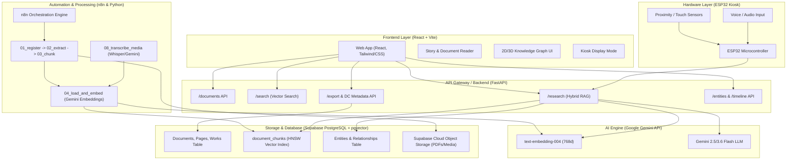
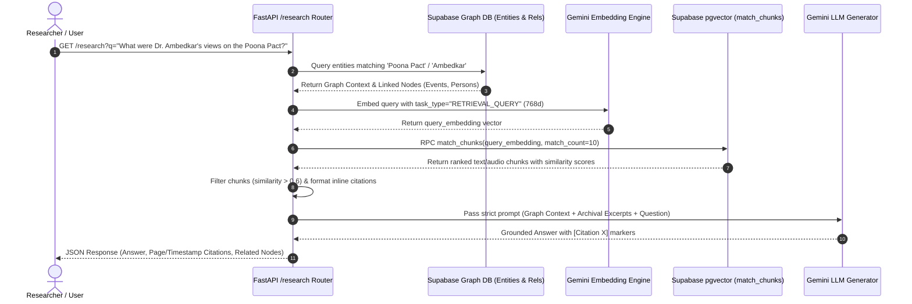

# Ambedkar Digital Heritage Archive: Technical Architecture Specification

## 1. System Overview & Architecture Paradigm

The **Ambedkar Digital Heritage Archive** is an open-access, AI-powered digital library, research platform, and interactive archival system designed to preserve, index, and analyze the complete writings, speeches, historical timelines, and multimedia assets of Dr. B. R. Ambedkar.

The platform follows a modern, decoupled microservices and event-driven architecture combining vector search, graph databases, automated ingestion workflows, and physical hardware kiosk integration.



---

## 2. Core Architecture Subsystems

### A. Page Index & Table of Contents Subsystem (`PageIndex`)

The **Page Index** bridges physical document representation (printed page numbers) with digital asset indexing (PDF page indices and structured Table of Contents metadata).

#### Key Components:
1. **Printed Page Mapping (`document_pages` table & `05_map_printed_pages.py`)**:
   - Stores the mapping between standard zero-indexed PDF page positions (`pdf_page`) and physical book page numbering (`printed_page`), accounting for prefaces, roman numerals, and offset page numbering.
2. **Works / TOC Table (`works` table)**:
   - Indexes distinct books, speeches, essays, and chapters within larger multi-volume collections (`AMB-EN-V01` through `AMB-EN-V22`).
   - Maps each work to its parent document ID, work title, work type (`Speech`, `Essay`, `Memorandum`, `Book`), and bounding page ranges (`start_page` to `end_page`).
3. **Cryptographic Integrity & Versioning (`documents` & `document_versions`)**:
   - Calculates immutable **SHA-256 cryptographic hashes** for every registered PDF file to prevent silent tampering or version drift.
   - Maintains an audit log (`audit_logs`) and version tree (`document_versions`) for archivist approvals and document edits.

```sql
-- Page Index & Toc Schema Snippet
CREATE TABLE document_pages (
  page_id TEXT PRIMARY KEY,
  document_id TEXT REFERENCES documents(id) ON DELETE CASCADE,
  pdf_page INT NOT NULL,         -- Index in the PDF file (0-indexed)
  printed_page TEXT,             -- Physical page number printed on header/footer
  language TEXT,
  text TEXT,
  ocr_required BOOLEAN DEFAULT FALSE,
  UNIQUE (document_id, pdf_page)
);

CREATE TABLE works (
  work_id TEXT PRIMARY KEY,
  document_id TEXT REFERENCES documents(id) ON DELETE CASCADE,
  title TEXT, 
  type TEXT, 
  start_page INT, 
  end_page INT, 
  language TEXT
);
```

---

### B. Retrieval-Augmented Generation (RAG) System

The **RAG Subsystem** handles grounded scholarly research queries using a hybrid retrieval mechanism that combines Knowledge Graph entity resolution with high-dimensional vector search.



#### Key Architecture Principles:
1. **Hybrid Context Generation**:
   - **Knowledge Graph Retrieval**: Identifies named entities (e.g., `AMB-PERSON-002`, `AMB-EVENT-014`) mentioned in the query and fetches 1st-degree incoming/outgoing relationships.
   - **Vector Similarity Search**: Executes an HNSW cosine similarity search over `document_chunks` using Google's `text-embedding-004` model (768 dimensions).
2. **Unified Text & Audio Grounding**:
   - Text chunks reference document ID and PDF page numbers (`[Citation 1] Document: AMB-EN-V01, Page: 45`).
   - Audio/video transcript chunks reference exact timestamp windows formatted as `mm:ss` (`[Citation 2] Document: AMB-AUD-003, Timestamp: 04:12–05:35`).
3. **Strict Archival Grounding Prompt**:
   - Mandates that the LLM state `"not found in the archive"` if similarity thresholds (>0.6) are unmet or if the context lacks facts.
   - Enforces zero hallucination of dates, names, or quotes.

---

### C. Open Knowledge Framework (OKF) & Open Data Standards

The archive adheres to **Open Knowledge Foundation (OKF)** guidelines and standard metadata frameworks to ensure public accessibility, machine-readability, and academic interoperability.

```
       +-------------------------------------------------------------+
       |             Internal Archival Record (documents)            |
       |  id: AMB-EN-V01 | title: Speech at Annihilation of Caste    |
       |  published_date: 1936 | language: english | sha256: 8f3a...  |
       +-------------------------------------------------------------+
                                      |
                                      v
            +----------------------------------------------------+
            |        Dublin Core (DC) Metadata Mapper            |
            |              (backend/app/routers/open_data.py)    |
            +----------------------------------------------------+
                                      |
         +----------------------------+----------------------------+
         |                                                         |
         v                                                         v
+-------------------------------+                         +-------------------------------+
|  JSON REST Endpoint           |                         |  Bulk CSV Export Endpoint     |
|  GET /documents/{id}/metadata |                         |  GET /export/documents.csv    |
|  {                            |                         |  BOM header + UTF-8 CSV       |
|    "dc:identifier": "...",    |                         |  Full archival catalogue      |
|    "dc:title": "...",         |                         |  for open data consumption    |
|    "dc:creator": "Dr. B.R...",|                         |                               |
|    "dc:rights": "Open Access" |                         |                               |
|  }                            |                         |                               |
+-------------------------------+                         +-------------------------------+
```

#### Standard Features:
- **Dublin Core (DC) Mapping**: Maps internal fields to standard Dublin Core attributes (`identifier`, `title`, `creator`, `date`, `language`, `type`, `source`, `rights`, `publisher`, `format`, `sha256`).
- **Open Data Endpoints**:
  - `GET /api/documents/{id}/metadata`: Individual document metadata formatted in Dublin Core schema.
  - `GET /api/export/documents.json`: Entire document catalogue in structured JSON format.
  - `GET /api/export/documents.csv`: Machine-readable CSV export with UTF-8 Byte Order Mark (BOM) for Excel compatibility.
  - `GET /api/export/works.json`, `/api/export/entities.json`, `/api/export/timeline.json`: Open graph and historical data dumps.
- **System Health Monitor (`GET /api/health/data`)**: Reports live exact counts of documents, indexed pages, vector chunks, and works.

---

### D. Automated Ingestion Workflows (`n8n`)

The archive uses **n8n** for visual workflow automation and pipeline orchestrations, converting raw historical PDFs and audio recordings into vector-indexed, graph-linked database records.

```
[ Manual / Webhook Trigger ]
            │
            ▼
   [ Set File Info ]  ──>  doc_id: AMB-DOC-002, filepath: .../AMB-DOC-002.pdf
            │
            ▼
    [ 01_register.py ] ──> SHA-256 hashing, verification, insert into 'documents'
            │
            ▼
  [ 02_extract_pages.py ] ──> PyMuPDF extraction -> 'document_pages' (pdf_page vs text)
            │
            ▼
    [ 03_chunk.py ] ──> Token sliding window chunking (~500 tokens) -> 'document_chunks'
            │
            ▼
[ 04_load_and_embed.py ] ──> Gemini text-embedding-004 vector generation -> pgvector
            │
            ▼
[ 04_upload_storage.py ] ──> Upload PDF binary to Supabase Object Storage
            │
            ▼
[ Update Knowledge Graph ] ──> Extract entities/relations & regenerate graph network
```

#### Step-by-Step Pipeline Mechanics:
1. **Registration (`01_register.py`)**: Computes `sha256`, extracts page count, registers document entry in `documents` table with status `approved` or `pending`.
2. **Page Extraction (`02_extract_pages.py`)**: Parses PDF text per page, flags low-confidence text for OCR pipeline, writes to `document_pages`.
3. **Chunking (`03_chunk.py`)**: Splits document pages into overlapping text chunks (`document_chunks`) with token count estimates.
4. **Vector Embedding (`04_load_and_embed.py`)**: Computes 768-dimensional embeddings via Gemini API and loads them into PostgreSQL `vector(768)` with an HNSW cosine index.
5. **Storage Upload (`04_upload_storage.py`)**: Pushes original PDF file to public/authenticated Supabase bucket `storage_path`.
6. **Knowledge Graph Sync (`06_load_graph.py`)**: Updates entity and relationship nodes linked by evidence page references.

---

### E. Additional Features & Subsystems

#### 1. Knowledge Graph & Timeline Explorer
- **Bi-directional Graph DB**: Tracks historical figures, organizations, movements, and legislative acts (`entities` table) connected via typed relationships (`relationships` table).
- **Interactive Visualization**: Frontend renders dynamic 2D/3D force-directed network graphs (`Graph.jsx`) with clickable evidence links leading directly to source documents and page numbers.
- **Chronological Timeline**: Filters and sorts event entities by year (`Timeline.jsx`), enabling users to navigate Dr. Ambedkar's life work chronologically.

#### 2. Audio & Multimedia Transcription Pipeline (`08_transcribe_media.py`)
- Transcribes audio/video speeches and historical recordings using Whisper/Gemini.
- Segments transcripts into timestamped audio chunks (`timestamp_start`, `timestamp_end`).
- Embeds audio transcriptions into the unified vector store, enabling semantic audio search and RAG citations with exact minute/second timestamps.

#### 3. Kiosk Hardware & Voice Controller (`kiosk-controller/esp32`)
- Hardware integration for museum/library public kiosk installations.
- Microcontroller (ESP32) listens to physical proximity sensors (PIR/ultrasonic) to trigger welcoming audio guidance.
- Microcontroller sends push-to-talk voice queries over HTTP to `/api/research`, playing back generated audio responses through kiosk speakers.

#### 4. Curated Story Reader & Archival Paths (`Stories.jsx`, `StoryReader.jsx`)
- Interactive, thematic guided tours (e.g., *Mahad Satyagraha*, *Framing the Constitution*, *Round Table Conferences*).
- Weaves primary source excerpts, graph entities, audio recordings, and timeline events into sequential educational modules for non-academic visitors.

---

## 3. Technology Stack Matrix

| Layer | Component / Tool | Technology Choice & Rationale |
| :--- | :--- | :--- |
| **Frontend UI** | Web Interface | React 18, Vite, Vanilla CSS / Tailwind CSS |
| **Data Viz** | Graph & Timeline | Force-Graph / 3D Graph, Lucide Icons |
| **Backend API** | REST Gateway | Python 3.10+, FastAPI, Uvicorn |
| **Database** | Database Engine | Supabase PostgreSQL + `pgvector` extension |
| **Vector Index** | Similarity Search | HNSW index (`vector_cosine_ops`), 768 dimensions |
| **AI Models** | Embeddings & LLM | Google Gemini `text-embedding-004` & Gemini Flash models |
| **Audio Processing** | Transcription | Whisper / Gemini Multimodal API |
| **Workflow Engine** | Orchestration | n8n (Node-based workflow automation engine) |
| **Metadata Standard** | Open Data | Dublin Core (DC) ISO-639 Mapping Schema |
| **Kiosk Hardware** | Microcontroller | ESP32, C++/Arduino Framework, HTTP API client |

---

## 4. End-to-End Data Flow Summary

```
+------------------+     1. Ingest PDF / Audio     +-------------------+
| Historical Data  | ----------------------------> |  n8n Pipeline     |
| (PDFs / Audio)   |                               |  (Register/Embed) |
+------------------+                               +-------------------+
                                                             |
                                                             | 2. Persist
                                                             v
+------------------+     3. Graph & Search Query   +-------------------+
|  Web / Kiosk UI  | <---------------------------- | Supabase DB       |
|  (User Request)  |                               | (Pgvector + Graph)|
+------------------+                               +-------------------+
         |                                                   ^
         | 4. Research Query                                 |
         v                                                   | 5. Retrieve Context
+------------------+ ----------------------------------------+
| FastAPI Gateway  |
| (/research)      | ──> 6. Grounded Prompt ──> [ Gemini LLM ] ──> 7. Response with Citations
+------------------+
```
